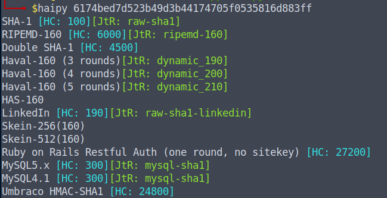

# Haipy

## What is it?

A CLI tool to identify hash types (hash type identifier).

This project is a Python porting of "haiti" https://github.com/noraj/haiti written in Ruby.

## Features

- 483+ hash types detected
- Modern algorithms supported (SHA3, Keccak, Blake2, etc.)
- Hashcat and John the Ripper references
- CLI tool
- Hackable
## Usage
```
haipy [hash code to guess]
```



## Installation

To install from pypi:
```
pip install haipy
```

To install from the source directory:
```
pip install .
```

## Author

Ported by @gcarmix, derived from haiti by @noraj

